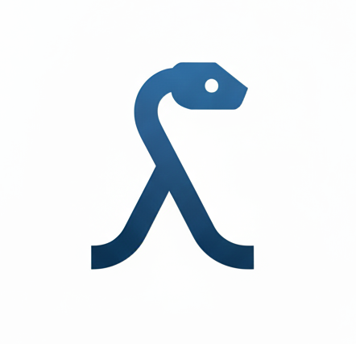

<p align="center">
  
</p>

<h1 align="center">Katharos</h1>

<p align="center">
  A functional programming and concurrency library for Python. Chain operations that can fail or return missing data, control when side effects run, and coordinate concurrent workers through <strong>typed channels</strong>.
</p>

<p align="center">
  <a href="https://pypi.org/project/katharos/"></a>
  <a href="https://katharos.readthedocs.io/en/latest/"></a>
  <a href="https://opensource.org/licenses/MIT"></a>
  
</p>

---

## Installation

Requires Python 3.13+.

```bash
pip install katharos
```

Or using `uv`:

```bash
uv add katharos
```

## Quick start

Turn exceptions into values and transform successful results:

```python
from katharos.types import Result


@Result.catch(ValueError)
def parse_int(raw: str) -> int:
    return int(raw)


print(parse_int("21").fmap(lambda n: n * 2))
# Success(42)

print(parse_int("oops").fmap(lambda n: n * 2))
# Failure(ValueError("invalid literal for int() with base 10: 'oops'"))
```

Successful values continue through the pipeline; failures skip subsequent
transformations. `Result.catch` catches the declared exception type and preserves
its traceback.

## Goals

Katharos exists to make functional-style Python practical, safe, and pleasant to write.

- **Errors, absence, and effects as values.** `Maybe`, `Result`, `IO`, and `Lazy` put failure, missing data, and side effects in the type signature, where they compose, instead of hiding them in `None` and exceptions.
- **Law-abiding abstractions.** `Functor`, `Applicative`, `Monad`, `Semigroup`, and `Monoid` come with their algebraic laws, checked by property-based tests (Hypothesis), so you can rely on them when you refactor.
- **Pythonic ergonomics.** Operators (`|`, `**`, `>>`, `@`) and `do`-notation keep functional code readable to Python developers. Everything is fully type-annotated and checked with pyright.
- **Message-passing concurrency.** Launch concurrent workers and communicate through typed channels. Channel receives return `Result` values for data, closure, and timeouts.
- **Approachable.** Tutorials come first, so you can learn one concept at a time by building something useful.

### Non-goals

- Not a port of the full Haskell or Scala typeclass ecosystem. Katharos covers a small, well-tested set of abstractions.
- Not a replacement for `asyncio`. The concurrency layer is thread-based message passing.

## What it looks like

Two everyday problems, each shown without and with Katharos.

### Missing values: `Maybe`

Without Katharos, every lookup needs its own `None` check:

```python
def find_user(user_id: int) -> str | None:
    return {1: "ada", 2: "grace"}.get(user_id)


def find_discount(user: str) -> float | None:
    return {"ada": 0.15}.get(user)


def lookup_discount(user_id: int) -> float | None:
    user = find_user(user_id)  # str | None
    if user is None:
        return None
    return find_discount(user)


print(lookup_discount(1))  # 0.15
print(lookup_discount(2))  # None: no discount
print(lookup_discount(3))  # None: no user
```

With Katharos, `find_user` and `find_discount` return a `Maybe`, and `do`-notation short-circuits on `Nothing`:

```python
from katharos.types import Maybe
from katharos.syntax_sugar import do, DoBlock


def find_user(user_id: int) -> Maybe[str]:
    return Maybe.from_optional({1: "ada", 2: "grace"}.get(user_id))


def find_discount(user: str) -> Maybe[float]:
    return Maybe.from_optional({"ada": 0.15}.get(user))


@do(Maybe)
def lookup_discount(user_id: int) -> DoBlock[Maybe, float]:
    user: str = yield find_user(user_id)
    discount: float = yield find_discount(user)
    return discount


print(lookup_discount(1))  # Just(0.15)
print(lookup_discount(2))  # Nothing(): no discount
print(lookup_discount(3))  # Nothing(): no user
```

### Failures: `Result`

Without Katharos, each step can raise, so callers must know which exceptions to catch:

```python
def process(raw: str) -> int:
    n = int(raw)                              # may raise ValueError
    if n <= 0:
        raise ValueError(f"{n} is not positive")
    return n


print(process("42"))  # 42
try:
    process("0")
except ValueError as error:
    print(error)  # 0 is not positive
```

With Katharos, failure is part of the return type, and steps chain with `|`:

```python
from katharos.types import Result


@Result.catch(ValueError)
def parse_int(raw: str) -> int:
    return int(raw)


def validate_positive(n: int) -> Result[ValueError, int]:
    if n <= 0:
        return Result.Failure(ValueError(f"{n} is not positive"))
    return Result.Success(n)


def process(raw: str) -> Result[ValueError, int]:
    return parse_int(raw) | validate_positive


print(process("42"))  # Success(42)
print(process("0"))   # Failure(ValueError('0 is not positive'))
print(process("??"))  # Failure(ValueError("invalid literal for int() with base 10: '??'"))
```

## Types at a glance

| Type | What it is for |
|------|----------------|
| `Maybe[A]` | A value that may be absent: `Just(value)` or `Nothing()` |
| `Result[E, A]` | A computation that may fail: `Success(value)` or `Failure(error)` |
| `ImmutableList[T]` | An immutable list for transforming, chaining, and combining values |
| `NonEmptyList[T]` | A list guaranteed to have at least one element |
| `IO[A]` | A lazy side effect, run explicitly with `.execute()` |
| `Lazy[A]` | A lazy, memoized synchronous computation, run with `.resolve()` |
| `Sum`, `Product` | Numeric monoids for combining numbers |

Types support operators according to their abstractions:

| Operator | Method | Meaning |
|----------|--------|---------|
| `\|` | `bind` | Feed a value into the next step (`>>=` in Haskell) |
| `**` | `ap` | Apply a wrapped function to a wrapped value (`<*>`) |
| `>>` | `then` | Sequence two steps, discarding the first value |
| `@` | `op` | Combine two values (`<>`) |

## Combining with `@`

The Semigroup operator combines two values of the same type:

```python
from katharos.types import ImmutableList

ImmutableList([1, 2]) @ ImmutableList([3, 4])  # ImmutableList([1, 2, 3, 4])
```

## Concurrency

Katharos provides **Go-style message-passing concurrency**: launch workers with `csp.go` and communicate over typed channels. `recv()` returns a `Result` containing a value, a closure error, or a timeout error.

### Channels

```python
from katharos.concurrency.csp import csp

ch = csp.Channel[int](capacity=1)

csp.go(ch.send, 42)     # run work concurrently, like Go's `go f(x)`

ch.recv()               # Success(42)

ch.close()
ch.recv()               # Failure(ChannelClosedError(...)): closure is a value, not a raise
```

Iterating a channel yields values until it is closed. This is the Fibonacci example from the [Go Tour](https://go.dev/tour/concurrency/4): a producer sends values and closes the channel, and the consumer ranges over it.

```python
from katharos.concurrency.csp import Channel, csp


def fibonacci(n: int, c: Channel[int]) -> None:
    x, y = 0, 1
    for _ in range(n):
        c.send(x)
        x, y = y, x + y
    c.close()


c = csp.Channel[int](capacity=10)
csp.go(fibonacci, 10, c)

for i in c:  # receives until the channel is closed
    print(i)  # 0 1 1 2 3 5 8 13 21 34
```

### Structured concurrency

Used as a context manager, `go` becomes a **scope** that joins everything spawned inside it before the block exits:

```python
from katharos.concurrency.csp import csp

def worker(n: int) -> None: ...

with csp.go:                 # scope waits for all work launched inside
    csp.go(worker, 1)
    csp.go(worker, 2)
# both workers have finished here
```

### Backends

The `csp` runtime uses standard Python threads by default. Supply a different `BaseThreadingBackend` to customize how workers run and synchronize.

## Documentation

[Start here: Getting Started with Katharos](https://katharos.readthedocs.io/en/latest/tutorials/getting-started.html).

Full tutorials, how-to guides, API reference, and explanations of the mathematical foundations are at **[katharos.readthedocs.io](https://katharos.readthedocs.io/en/latest/)**.

## License

MIT
